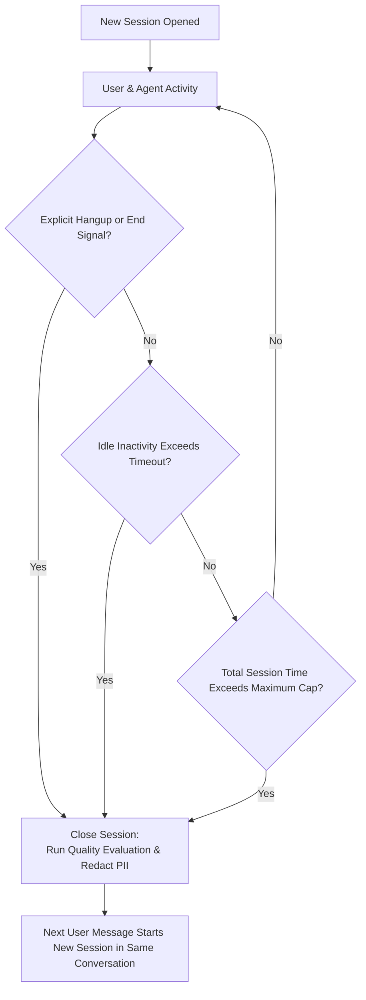

import { Callout } from 'fumadocs-ui/components/callout';

# Conversation Boundaries & Session Lifecycles

In conversational artificial intelligence (AI), determining when an interaction begins and ends is essential for accurate analytics, performance scoring, and cost tracking. Parlot handles this using a **two-level model of conversations and sessions**, governed by channel-aware boundary rules.

Boundary rules determine when a **session** transitions from **open** (actively exchanging messages or audio) to **closed**. Closing a session triggers downstream workflows—including automated quality evaluations, privacy redactions to remove personally identifiable information (PII), analytics rollups, and billing calculations.

---

## Conversations vs. Sessions: A Two-Level Hierarchy

To understand boundary rules, it is helpful to distinguish between a **conversation** and a **session**:

- **Conversation (Unbounded)**: The ongoing thread between a user and an agent within a channel. A conversation represents the long-term relationship. It does not close; instead, it accumulates sessions over time.
- **Session (Bounded Episode)**: A distinct, bounded interaction episode with a clear start and end. The session is the primary unit of evaluation, analytics, and observability in Parlot. All telemetry events—including audio streams, language model responses, tool executions, transcripts, and latency measurements—are grouped under a session.

```
Conversation (ongoing, channel-scoped thread)
  ├── Voice Channel: 1 conversation ↔ 1 session (typical phone call)
  │     └── Session: Call starts 09:00 → Caller hangs up 09:12 (Closed)
  │
  └── Messaging Channels: 1 conversation ⊃ Multiple sessions over time
        ├── Session 1 (Morning): User asks about billing → 15-minute idle timeout → Session closed & evaluated
        └── Session 2 (Afternoon): Same user follows up on payment → New session opened in same conversation
```

### Modality Differences: Voice vs. Messaging
The relationship between conversations and sessions depends directly on the communication channel:

- **Voice Calls**: In voice applications (such as phone calls or real-time audio rooms), a single session almost always makes up the entire conversation. The call connects, the interaction takes place, and the call terminates upon hangup. Here, the conversation and session map one-to-one.
- **Text Messaging & Messaging Apps**: On asynchronous channels like text messaging (SMS), webchat widgets, and WhatsApp, a single conversation can span multiple distinct sessions across hours, days, or weeks. When a customer stops responding, Parlot closes that session so it can be analyzed. If the customer messages again later, the interaction begins a fresh session within the same overarching conversation.

---

## Why Boundary Rules Matter

Without intelligent boundary rules:
- **Asynchronous messaging conversations** would linger as a single, open-ended session that never closes. Quality evaluations, PII redactions, and cost aggregations would be delayed indefinitely.
- **Abandoned or unclosed voice calls** could remain marked as active if an explicit hangup event failed to reach the server, distorting real-time concurrency metrics and dashboards.
- **Fragmented interactions** could occur if inactivity limits are set too aggressively, prematurely cutting off users who simply take a moment to type or review information.

Parlot solves this with **channel-aware boundary policies** that combine an **inactivity timeout** (closing an idle session after a period of silence) with a **maximum duration cap** (a safety ceiling on overall session length).

---

## Session Close Triggers

Parlot marks an open session closed whenever any of the following conditions are met:

1. **Explicit End Signal**: The agent or telephony gateway explicitly signals that the call or interaction has concluded (for example, the caller hangs up the phone or the user closes the chat widget).
2. **Idle Inactivity Timeout**: No new user messages, audio packets, or agent responses have arrived for the configured duration since the last observed activity.
3. **Maximum Session Duration Cap**: The session has been open longer than the allowed time ceiling since it first started, regardless of ongoing interaction. This serves as a vital safeguard against infinite loops, runaway scripts, or hung telephone lines.



---

## Built-In Defaults by Channel

Different communication channels follow very different conversational rhythms. Parlot provides sensible, production-ready defaults tailored to each medium:

| Channel | Idle Inactivity Timeout | Maximum Duration Cap | Rationale |
| :--- | :--- | :--- | :--- |
| **Voice** | **Disabled** (0 minutes) | **30 minutes** | Voice calls close immediately upon hangup signal. The 30-minute cap serves as an emergency safeguard against hung telephone lines. |
| **Webchat** | **15 minutes** | **12 hours** | Website visitors typically chat while actively browsing. If 15 minutes elapse without interaction, the session concludes so evaluations can run. |
| **Text Messaging** | **60 minutes** (1 hour) | **12 hours** | Text messaging (SMS) is semi-asynchronous; users frequently step away and take several minutes or hours to reply between turns. |
| **WhatsApp** | **24 hours** (1 day) | **7 days** | Aligns with WhatsApp's standard 24-hour customer service messaging window. |
| **Fallback (Custom Channels)** | Matches **Voice** (Disabled) | Matches **Voice** (**30 minutes**) | Any custom or unrecognized channel identifier safely adopts the voice defaults until you explicitly customize it. |

<Callout type="info" title="Automatic Fallback Protection">
  Your organization does not need to configure rules before going live. If you have not customized a specific channel, Parlot automatically applies these built-in defaults. Custom rules you save in the dashboard will take precedence immediately.
</Callout>

---

## Configuring Boundaries in the Web Dashboard

You can customize boundary rules for your team at any time through the Parlot user interface (UI).

### 1. Navigating to Conversation Boundaries
In the left sidebar, click **Settings**, then select **Conversation boundaries** under the **Agents** section (or navigate directly to `/settings/conversations`).

### 2. Viewing Current Channel Settings
The overview table displays all supported channels for your organization (`voice`, `webchat`, `sms`, and `whatsapp`):
- **Channel**: The canonical channel name.
- **Idle Timeout**: The inactivity threshold before an idle session is closed (for example, `15m`, `1h`, or `Disabled`).
- **Maximum Duration**: The absolute time ceiling for a session (for example, `30m`, `12h`, or `7d`).
- **Status Badge**: Displays `Default` when using Parlot's standard defaults, or `Custom` when adjusted for your team.

### 3. Editing a Channel's Boundary Rules
Click the **Edit** (pencil) icon next to any channel:

1. **Idle Inactivity Timeout**:
   - Check or uncheck **Enable idle timeout**.
   - Choose your preferred time unit: **Minutes**, **Hours**, or **Days**.
   - Enter the desired duration (e.g., `30` minutes).
2. **Maximum Duration**:
   - Choose the time unit (**Minutes**, **Hours**, or **Days**).
   - Enter the duration ceiling (e.g., `2` hours).
3. Click **Save channel**. The updated rules apply immediately to ongoing and future sessions.

### 4. Resetting to Defaults
- **Revert an Individual Channel**: If a channel has been customized, click the **Revert to default** (reset) icon next to it in the table. Its custom rule is removed, and the channel instantly restores Parlot's standard defaults.
- **Reset All Channels**: Click **Reset to defaults** in the page header to clear all custom overrides and restore the original default matrix for your entire organization.

---

## How Session Cleanup Works Behind the Scenes

Parlot runs an automated background cleanup process to keep conversation records current and accurate:

1. **Continuous Monitoring**: An automated sweeper regularly scans all active, open sessions across channels.
2. **Rule Evaluation**: For each open session, the sweeper evaluates the timestamp of the last observed message or audio transmission against that channel's idle timeout and maximum duration limits.
3. **Orderly Closure**: If a session has timed out, Parlot marks the session closed and dispatches it to downstream processing.
4. **Post-Processing Actions**:
   - **Privacy Redaction**: Detects and redacts sensitive data, such as personally identifiable information (PII), payment card details, and contact numbers from stored transcripts.
   - **Quality Evaluation**: Runs automated scoring models to evaluate customer sentiment, goal completion, and agent accuracy.
   - **Metrics Aggregation**: Calculates session durations, turn counts, and cost metrics for your analytics dashboards.

---

## Best Practices & Recommendations

- **Tune Webchat to Your Application Flow**: If your website chat widget preserves conversation history when users navigate between pages, an idle timeout between 15 and 30 minutes prevents new sessions from starting on every page refresh while still bounding customer inquiries into coherent episodes.
- **Respect Messaging Windows**: When using third-party messaging platforms like WhatsApp, match your idle timeout to the platform's official customer care window (24 hours) so a customer's follow-up questions stay in the same session.
- **Always Keep a Maximum Duration Cap**: Never leave a channel without a maximum duration ceiling. A ceiling (such as 12 or 24 hours) protects your infrastructure from unexpected connection drops, network partitions, or agent client errors that fail to send an explicit hangup signal.
