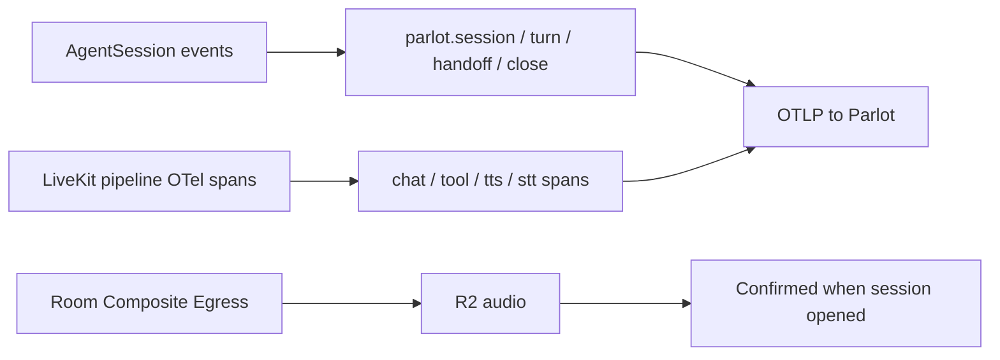

# LiveKit

You already ship [LiveKit Agents](https://docs.livekit.io/agents/). Parlot is an MIT `parlotize()` sidecar that turns each call into a debuggable session — turns, handoffs, latency, and audio evidence — not another dashboard that only shows the pipeline returned 200s.

Install and env setup: [Quick Start](/sdk/get-started/quick-start). Shared product model: [Concepts](/sdk/get-started/concepts).

## What you get in Parlot

- **Session + transcript** — who said what, turn timeline, close reason
- **Multi-agent handoffs / agent chain** — routing across agents in one call
- **Pipeline waterfall** — LLM / TTS / tools / STT timing when LiveKit pipeline spans are present
- **Usage** — tokens, tool counts
- **Session audio** — Room Composite Egress → replay when you open the session
- **Export per session** — download transcript + recording (and optionally traces / logs / metadata) from the session UI for compliance, reviews, or offline analysis
- **Same debugger if you nest LangGraph** — see the [LangGraph guide](/sdk/guides/langgraph)

## How instrumentation works



**Two layers feed Parlot:**

1. **Events (semantic)** — AgentSession events commit the conversation. Bootstrap runs when the agent transitions `initializing → listening` (`agent_state_changed`), minting one `parlot.session`. Committed messages become `parlot.turn` / handoffs; `close` ends with a normalized close reason. This is the episode record (transcript, usage, handoffs) even without pipeline spans.
2. **OTel spans (pipeline)** — LiveKit’s internal spans (`llm_*`, `tts_*`, `function_tool`, …) are enriched, renamed to the shared GenAI / voice vocabulary, and stripped of `lk.*` keys before OTLP export. Native turn spans contribute latency onto `parlot.turn`, then are dropped from export. Pipeline spans unlock the debugger waterfall and turn latency histograms.

**Recording** is a separate path: after bootstrap the agent requests an upload grant and starts Room Composite Egress (audio-only OGG → R2). Telemetry does not wait on audio confirmation — opening the session in Parlot reconciles the object and flips `audio_available`.

Shared span layers, identity, errors, and capture policies: [Concepts](/sdk/get-started/concepts).

## Add it to an existing agent

Two required steps for full behavior:

1. Call `parlotize("…")` **before** constructing `AgentSession`.
2. Call `await ctx.connect()` **before** `session.start()`.

```python
from parlot.instrumentation.livekit import parlotize

parlotize("my-agent", version="0.1.0")

from livekit.agents import AgentSession, JobContext


async def entrypoint(ctx: JobContext):
    await ctx.connect()

    session = AgentSession(...)
    await session.start(agent=..., room=ctx.room)
```

`parlotize()` registers an OTLP `TracerProvider` with `livekit.agents.telemetry`, installs AgentSession event hooks, and (when recording is enabled) starts egress after session bootstrap. Pass a stable deployment id; use `version=` for a real deployment label (otherwise Parlot stamps `"unknown"`).

Environment: `PARLOT_ENDPOINT`, `PARLOT_API_KEY` — see [Environment Variables](/sdk/env-vars). Recording, session logs, and generative AI content capture are on by default for new tenants; configure in Settings or via `parlotize(...)` kwargs — see [Concepts → Recording vs telemetry](/sdk/get-started/concepts#recording-vs-telemetry). LiveKit egress also needs agent `LIVEKIT_*` credentials with **`roomRecord`**.

Shared `parlotize()` options: [Python SDK Reference](/sdk/python). LiveKit-only kwargs (`record`, `auto_escalate_sip`, …): [Interactive API Reference](/docs/ref/python/parlot/instrumentation/livekit.html).

## Named worker dispatch (`agent_name`)

LiveKit’s **`agent_name`** (which jobs are eligible for which rooms) is separate from Parlot’s `parlotize("…")` / `session.agent_id` (canonical product identity on telemetry).

Prefer an explicit name on the RTC session entrypoint:

```python
from livekit.agents import AgentServer, JobContext

server = AgentServer()


@server.rtc_session(agent_name="healthcare")
async def entrypoint(ctx: JobContext):
    await ctx.connect()
    ...
```

Without a name, the worker is eligible for automatic assignment into any room that requests an agent. Paths such as LiveKit `WarmTransferTask` open a second room for briefing; an unnamed worker will be auto-dispatched there and mint a **second Parlot session** for the same caller journey. Keep playground, SIP dispatch rules, and `lk dispatch` aligned with the same name. See the [healthcare example](https://github.com/parlot-ai/sdk/blob/main/examples/livekit/healthcare/README.md) for a full WarmTransferTask setup.

## Human escalation

Semantics and role vocabulary live in [Concepts → Human escalation](/sdk/get-started/concepts#human-escalation). Import helpers from the LiveKit package:

```python
from parlot.instrumentation.livekit import record_human_rep, human_escalation

record_human_rep("support_rep_jane", label="Jane")

# Or wrap a dial / transfer:
# with human_escalation(label="L2 Support Queue"):
#     await session.dial(sip_uri)
```

For SIP warm transfer auto-detect, set `parlotize("my-agent", auto_escalate_sip=True)` (and a named `agent_name` so the briefing room does not spawn a duplicate session). Or match participant metadata with `escalation_metadata_match={...}`.

## Next

- [Quick Start](/sdk/get-started/quick-start)
- [Concepts](/sdk/get-started/concepts)
- Examples: [`examples/livekit/`](https://github.com/parlot-ai/sdk/tree/main/examples/livekit/)
- [Python SDK Reference](/sdk/python) · [Interactive API Reference](/docs/ref/python/parlot/instrumentation/livekit.html)
- Nesting LangGraph inside a voice agent? [LangGraph guide](/sdk/guides/langgraph)
